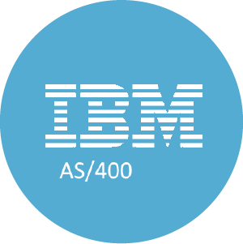

<!-- Begin README -->

    

 

    
     
    
    
    
     
    

---------------

<h1 align="center">RPGLE Program: Data Processing Example</h1>

This repository contains an example `RPGLE` program that demonstrates reading data from an input file, processing it, and writing the results to an output file.
- `RPGLE` is a high-level programming language for business applications.
- The program is written in `RPGLE` for the IBM i (AS/400) system.
- The program is designed to be compiled and run on the IBM i (AS/400) system.

---------------

## Table of Contents

- [Features](#features)
- [Getting Started](#getting-started)
    - [Usage](#usage)
    - [Important Notes](#important-notes)
- [Resources](#resources)
- [License](#license)
- [Credits](#credits)

## Features

- Reads data from an input file (`INPUTFILE`) using the `ReadInput` procedure.
- Processes each record to double the Quantity field and writes the result to an output file (`OUTPUTFILE`) using the WriteOutput procedure.
- Illustrates basic file I/O operations, data manipulation, and modularization of code using procedures.

## Getting Started

### Usage

1. Clone this repository to your local machine.
2. Customize the program by specifying the correct file names for inputFile and outputFile.
3. See [process.rpgle](process.rpgle) as an example.
4. Ensure you have access to the required input and output files.
5. Compile and run the `RPGLE` program using an `RPG` compiler (e.g., IBM Rational Development Studio, IBM i PDM, etc.).
6. Check the output file to view the processed data.

### Important Notes

- This is a simplified example for demonstration purposes.
- The program assumes that the input and output files are defined and accessible on the IBM i (AS/400) system.

## Resources

- [IBM RPGLE Reference](https://www.ibm.com/docs/en/i/7.4)

## License

This project is released under the terms of **The Unlicense**, which allows you to use, modify, and distribute the code as you see fit. 
- [The Unlicense](https://choosealicense.com/licenses/unlicense/) removes traditional copyright restrictions, giving you the freedom to use the code in any way you choose.
- For more details, see the [LICENSE](LICENSE) file in this repository.

## Credits

**Author:** [Scott Grivner](https://github.com/scottgriv)  
**Email:** [scott.grivner@gmail.com](mailto:scott.grivner@gmail.com)  
**Website:** [linktr.ee/scottgriv](https://www.linktr.ee/scottgriv)  
**Reference:** [Main Branch](https://github.com/scottgriv/rpgle-data_processing)  

---------------

    

<!-- End README -->
